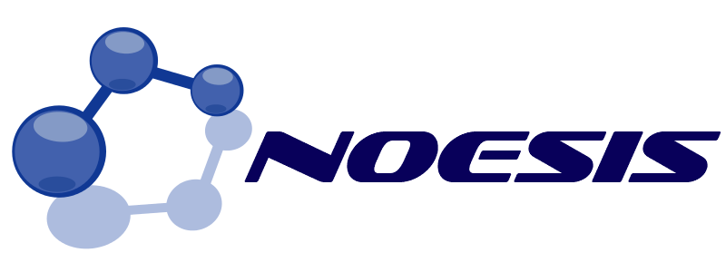

# NOESIS for Python
Official Python API for [NOESIS](http://noesis.ikor.org), an open source framework for network data mining that provides a large collection of network analysis techniques, including the analysis of network structural properties, community detection methods, link scoring, and link prediction, as well as network visualization algorithms.

## Installation
From source:
```console
git clone https://github.com/fvictor/noesis-python.git
cd noesis-python
python setup.py install
```
From [PyPi](https://pypi.python.org/pypi/noesis):
```console
pip install noesis
```

## Getting started
NOESIS for Python provides simple and unified interfaces for most of the implemented techniques. The following example loads a network from a GML file and detects its communities using the Kernighan–Lin algorithm:
```python
from noesis import Noesis

ns = Noesis()

network_reader = ns.create_network_reader('GML')
network = network_reader.read('my_network.gml')

community_detector = ns.create_community_detector('KernighanLin')
communities = community_detector.compute(network)

for node in range(network.nodes()):
	print('Node {} belongs to community {}'.format(node, communities[node]))

ns.end()
```

The following example generates a network of 20 nodes and 100 links using the Erdös–Rényi model and computes the PageRank score of each node:
```python
from noesis import Noesis

ns = Noesis()

network = ns.create_network_from_model('ErdosRenyi', 20, 100)

pagerank_scorer = ns.create_node_scorer('PageRank', 0.9)
scores = pagerank_scorer.compute(network)

for node in range(network.nodes()):
	print('Node {} has a PageRank score of {}'.format(node, scores[node]))

ns.end()
```


Always remember to call the *end* method of *Noesis* class to properly terminate the NOESIS session and finish the execution of your program.

